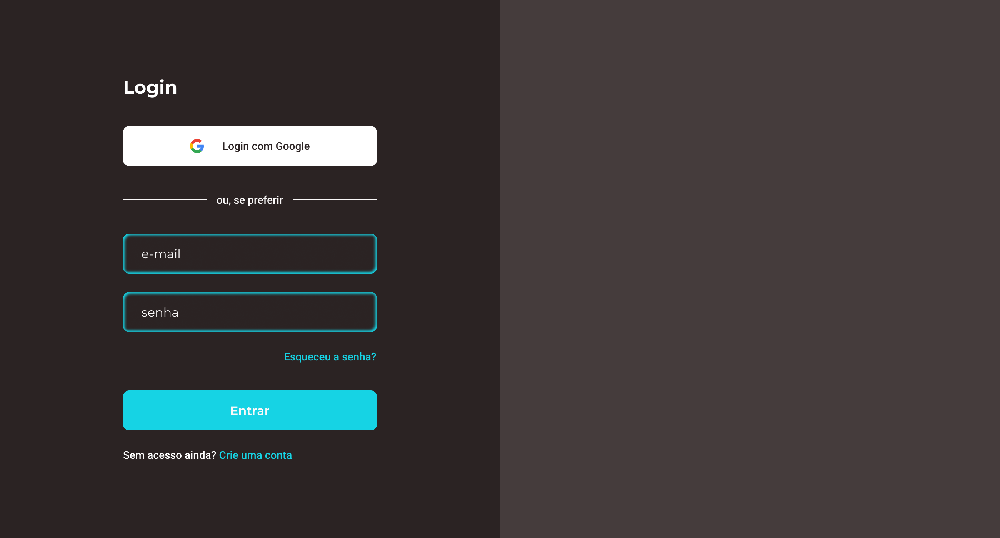

<h1 align="center">Login-page</h1>

<p align="center">Esse projeto é uma página para login, criar conta e resetar senha utilizando AWS authentication.</p>

---

<h1 align="center">
  
</h1>

<a href="">Ver o projeto no ar (em breve)</a>

### Features
- [x] Confirmação com envio de código por e-mail
- [x] Criar uma conta
- [x] Login
- [x] Resetar senha

### Pré-requisitos

Antes de começar, você vai precisar ter instalado em sua máquina as seguintes ferramentas:
[Git](https://git-scm.com), [Node.js](https://nodejs.org/en/).

Além disto é bom ter um editor para trabalhar com o código como [VSCode](https://code.visualstudio.com/)

### Rodando a aplicação

```bash
# Clone este repositório
$ git clone https://github.com/andersonszdc/Login-page

# Acesse a pasta do projeto no terminal/cmd
$ cd Login-page

# Instale as dependências
$ npm install

# Para iniciar o servidor, execute este comando
$ npm run dev
```


### Tecnologias

As seguintes ferramentas foram usadas na construção do projeto:

- [NextJS](https://www.typescriptlang.org/)
- [TypeScript](https://www.typescriptlang.org/)
- [Prismic.io](https://prismic.io/)
- [Styled Components](https://styled-components.com/)
- [React-Markdown](https://github.com/remarkjs/react-markdown#readme)
- [Eslint](https://eslint.org/)
- [Commitizen](https://github.com/commitizen/cz-cli)
- [Nodemailer](https://nodemailer.com/about/)
- [Handlebars](https://handlebarsjs.com/)


---

### Autor


Made with 💜 by andersonszdc

<a href="https://www.linkedin.com/in/anderson-souza-b28431198/" target="_blank"></a>
<a href="https://www.instagram.com/andersonszdc" target="_blank"></a>
